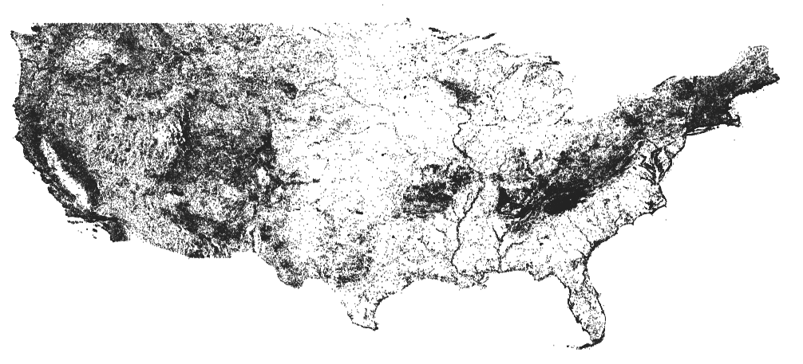

# Creating Spatial Data

A common operation in spatial analysis is to take non-spatial data, such as CSV files, and creating a spatial dataset from it using coordinate information contained in the file. GeoPandas provides a convenient way to take data from a delimited-text file, create geometry and write the results as a spatial dataset.

We will read a tab-delimited file of places, filter it to a feature class, create a GeoDataFrame and export it as a GeoPackage file.


```python
import os
import pandas as pd
import geopandas as gpd
```


```python
data_pkg_path = 'data/geonames/'
filename = 'US.txt'
path = os.path.join(data_pkg_path, filename)
```

## Reading Tab-Delimited Files

The source data comes from [GeoNames](https://en.wikipedia.org/wiki/GeoNames) - a free and open database of geographic names of the world. It is a huge database containing millions of records per country. The data is distributed as country-level text files in a tab-delimited format. The files do not contain a header row with column names, so we need to specify them when reading the data. The data format is described in detail on the [Data Export](https://www.geonames.org/export/) page.

We specify the separator as **\\t** (tab) as an argument to the `read_csv()` method. Note that the file for USA has more than 2M records.


```python
column_names = [
    'geonameid', 'name', 'asciiname', 'alternatenames', 
    'latitude', 'longitude', 'feature class', 'feature code',
    'country code', 'cc2', 'admin1 code', 'admin2 code',
    'admin3 code', 'admin4 code', 'population', 'elevation',
    'dem', 'timezone', 'modification date'
]

df = pd.read_csv(path, sep='\t', names=column_names)
print(df.info())
```

    C:\Users\ujaval\anaconda3\envs\python_foundation\lib\site-packages\IPython\core\interactiveshell.py:3063: DtypeWarning: Columns (9,11) have mixed types.Specify dtype option on import or set low_memory=False.
      interactivity=interactivity, compiler=compiler, result=result)


    <class 'pandas.core.frame.DataFrame'>
    RangeIndex: 2237861 entries, 0 to 2237860
    Data columns (total 19 columns):
     #   Column             Dtype  
    ---  ------             -----  
     0   geonameid          int64  
     1   name               object 
     2   asciiname          object 
     3   alternatenames     object 
     4   latitude           float64
     5   longitude          float64
     6   feature class      object 
     7   feature code       object 
     8   country code       object 
     9   cc2                object 
     10  admin1 code        object 
     11  admin2 code        object 
     12  admin3 code        float64
     13  admin4 code        float64
     14  population         int64  
     15  elevation          float64
     16  dem                int64  
     17  timezone           object 
     18  modification date  object 
    dtypes: float64(5), int64(3), object(11)
    memory usage: 324.4+ MB
    None


## Filtering Data

The input data as a column `feature_class` categorizing the place into [9 feature classes](https://www.geonames.org/export/codes.html). We can select all rows with the value `T` with the category  *mountain,hill,rock...*


```python
mountains = df[df['feature class']=='T']
print(mountains.head()[['name', 'latitude', 'longitude', 'dem','feature class']])
```

                     name  latitude  longitude   dem feature class
    15       Vulcan Point  52.10222  177.53889 -9999             T
    16     Tropical Ridge  51.99167  177.50833   267             T
    17  Thirty-Seven Hill  52.84528  173.15278   193             T
    20       Square Point  52.86120  173.33679    30             T
    21       Square Bluff  51.65000  178.70000 -9999             T


## Creating Geometries

GeoPandas has a conveinent function `points_from_xy()` that creates a Geometry column from X and Y coordinates. We can then take a Pandas dataframe and create a GeoDataFrame by specifying a CRS and the geometry column.


```python
geometry = gpd.points_from_xy(mountains.longitude, mountains.latitude)
gdf = gpd.GeoDataFrame(mountains, crs='EPSG:4326', geometry=geometry)
print(gdf.info())
```

    <class 'geopandas.geodataframe.GeoDataFrame'>
    Int64Index: 225328 entries, 15 to 2237836
    Data columns (total 20 columns):
     #   Column             Non-Null Count   Dtype   
    ---  ------             --------------   -----   
     0   geonameid          225328 non-null  int64   
     1   name               225328 non-null  object  
     2   asciiname          225328 non-null  object  
     3   alternatenames     30933 non-null   object  
     4   latitude           225328 non-null  float64 
     5   longitude          225328 non-null  float64 
     6   feature class      225328 non-null  object  
     7   feature code       225328 non-null  object  
     8   country code       225328 non-null  object  
     9   cc2                5 non-null       object  
     10  admin1 code        225327 non-null  object  
     11  admin2 code        225170 non-null  object  
     12  admin3 code        21646 non-null   float64 
     13  admin4 code        0 non-null       float64 
     14  population         225328 non-null  int64   
     15  elevation          224417 non-null  float64 
     16  dem                225328 non-null  int64   
     17  timezone           225273 non-null  object  
     18  modification date  225328 non-null  object  
     19  geometry           225328 non-null  geometry
    dtypes: float64(5), geometry(1), int64(3), object(11)
    memory usage: 36.1+ MB
    None


## Writing Files

We can write the resulting GeoDataFrame to any of the supported vector data format. Here we are writing it as a new GeoPackage file.

You can open the resulting geopackage in a GIS and view the data.




```python
output_dir = 'output'
output_filename = 'mountains.gpkg'
output_path = os.path.join(output_dir, output_filename)

gdf.to_file(driver='GPKG', filename=output_path, encoding='utf-8')
print('Successfully written output file at {}'.format(output_path))
```

## Exercise

The data package contains multiple geonames text files from different countries in the `geonames/` folder. Write code to read all the files, merge them and extract the mountain features to a single geopackage.

- Hint1: Use the `os.listdir()` method to get all files in a directory.
- Hint2: Use the Pandas method `concat()` to merge multiple dataframes.

----
